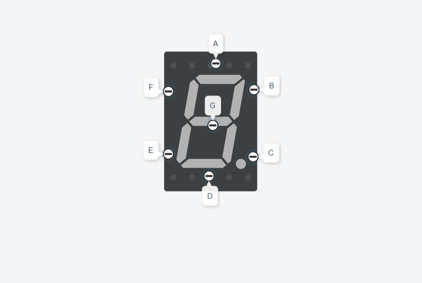

# Dojo N°2 - Estación de Subte
- [Descripción](#descripción)
- [Funciones del Código](#funciones-del-código)
- [Display 7 Segmentos](#display-7-segmentos)
- [Cuenta Regresiva](#cuenta-regresiva)
- [Cambio de Estacion](#cambio-de-estacion)
- [Sistema Principal](#sistema-principal)

---


👉 [Link del Proyecto](https://www.tinkercad.com/things/cdI0Q7Ipu1Y)

## Descripción

Sistema que permita al usuario saber a qué estación de subte está llegando.

Trabajo realiazado en el segundo dojo de Sistemas de Procesamiento de Datos (SPD) en arduino y tinkercad.

El programa comienza cuando se enciende el pulsador. El recorrido comienza en el LED rojo (Constitución) encendiendolo y mostrando cuantas estaciones faltan para llegar al LED azul (Moreno). Tambien hace zonar el buzzer y cambia su sonido por cada estación que avanza.

El recorrido comienza en Constitucion y termina en Moreno (3 estaciones). Una vez que le contador llega a destino (0) vuelve a Constitucion.

1. Componentes necesarios:
    - Placa Arduino 
    - 4 LEDs de colores
    - Display de 7 segmentos
    - Buzzer
    - Pulsador
    - Resistencias 
2. Conexión de componentes:
    - Conecta los 4 LEDs a diferentes pines digitales del Arduino.
    - Conecta el display de 7 segmentos a los pines digitales de la placa.
    - Conecta el buzzer y el pulsador a un pin digital del Arduino.
3. Programación del Arduino:
    - Configura los pines de entrada y salida en **setup()**.
    - En el **loop()**, verifica si el botón ha sido presionado.
    - Si el botón fué presionado, inicia la secuencia de las estaciones del subte.
    - Enciende cada LED y actualiza el display de 7 segmentos para mostrar cuantas estaciones faltan.
    - Emite un sonido diferente en el buzzer para cada estación.

## Funciones del Código

### Display 7 Segmentos


Cada letra dentro del **array** representa un led del display 7 segmentos.

<br>

```c++
void ApagarPrender7Segmentos(int apagarPrender)
{
  int segmentos[] = {a, b, c, d, e, f, g};

  for (int i = 0; i < 7; i++) {
    digitalWrite(segmentos[i], apagarPrender);
  }
} 
```

La funcion apaga o prende todos pines según el parametro recibido (HIGH o LOW). 

Esto me permite agilizar formar cada numero que deba mostrar con el display. Teniendo que unicamente encender u apagar los pines restantes para formar cada numero.

```c++
void NumeroUno() 
{
//Apaga todos los pines
  ApagarPrender7Segmentos(LOW);
  digitalWrite(b, HIGH);
  digitalWrite(c, HIGH);
}

void NumeroDos()
{
//Enciende todos los pines
  ApagarPrender7Segmentos(HIGH);
  digitalWrite(c, LOW);
  digitalWrite(f, LOW);
}

void NumeroTres() 
{
//Enciende todos los pines
  ApagarPrender7Segmentos(HIGH);
  digitalWrite(e, LOW);
  digitalWrite(f, LOW);
}
```

Cada función enciende y/o apaga los segmentos del display según sea necesario para mostrar el número correspondiente (0-3).

<br>

### Cuenta Regresiva

```c++
void CuentaRegresiva(int numero)
{
  switch (numero) {
    case 3:
      NumeroTres();
      break;
    case 2:
      NumeroDos();
      break;
    case 1:
      NumeroUno();
      break;
  }
}
```

La funcion llama a las funciones anteriores según el numero que recibe.

### Cambio de Estacion

La función recibe la `estacion` a la que se va a dirigir (para encender su respectivo LED), el `numero` que representa cuantas estaciones faltan para llegar a la última estación. Ademas de la `frecuencia` en la que suena el buzzer para cada estación.

```c++
void CambioDeEstacion(int estacion, int numero, int frecuencia) 
{
  digitalWrite(estacion, HIGH);
  CuentaRegresiva(numero);
  tone(BUZZER, frecuencia, 1000);
  delay(1000);
  digitalWrite(estacion, LOW);
  ApagarPrender7Segmentos(LOW);
  delay(1000);
}
```

Enciende el LED de la estacion indicada y comienza la cuenta regresiva junto al tono del buzzer durante 1seg. Luego apaga tanto el LED como el display.

### Sistema Principal

Se configura el pin del **pulsador** como una entrada con una resistencia **pull-up interna**.

Esto quiere decir que cuando el pulsador no sea presionado, el pin se mantendrá en un estado alto (HIGH) debido a la resistencia interna. Cuando el pulsador se presiona, el estado del pin cambiará a bajo (LOW).

Esto nos evitará tener que añadir más elementos a nuestros circuitos.

Se configura el pin del **buzzer** como una salida analogica. Esto permite controlar el dispositivo, ajustar su frecuencia y duracion.

```c++
void setup()
{
  for (int i = 2; i < 15; i++) {
    pinMode(i, OUTPUT);
  }
  pinMode(PULSADOR, INPUT_PULLUP);
  pinMode(BUZZER, OUTPUT);
  Serial.begin(9600);
}
```
En el bucle for se configuran los pines de 2 al 14 como salidas digitales, que son todos los LEDs y pines del display 7 segmentos. Por ultimo, se inicializa el puerto serial para mostrar mensajes en la consola.

Lee el estado del pulsador utilizando la función `digitalRead()`. Si el pulsador está presionado (estado **LOW**), se ejecuta el bucle while.

Se llama a la función `CambioDeEstacion()` para pasar a la proxima estación. 

```c++
void loop()
{
  while(digitalRead(PULSADOR) == LOW)
  {
    ImprimirProximaEstacion("San Juan");
    CambioDeEstacion(CONSTITUCION, 3, 100);

    ImprimirProximaEstacion("Indepencia");
    CambioDeEstacion(SAN_JUAN, 2, 150);
    
    ImprimirProximaEstacion("Moreno");
    CambioDeEstacion(INDEPENDENCIA, 1, 200);
    
    ImprimirProximaEstacion("Indepencia");
    CambioDeEstacion(MORENO, 3, 250);
    
    ImprimirProximaEstacion("San Juan");
    CambioDeEstacion(INDEPENDENCIA, 2, 200);
    
    ImprimirProximaEstacion("Constitucion");
    CambioDeEstacion(SAN_JUAN, 1, 150);
   }
}
```

Dentro del bucle, se imprimen en el monitor serial las siguientes estaciones del subte utilizando la función `ImprimirProximaEstacion()`.

```c++
void ImprimirProximaEstacion(String destino)
{
  Serial.println("Proxima estacion: " + destino);
}
```
---
Si deseas contribuir a este proyecto, no dudes en enviar un pull request o abrir un issue en GitHub.
